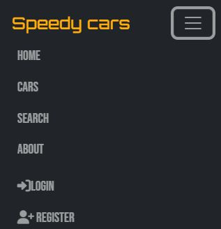
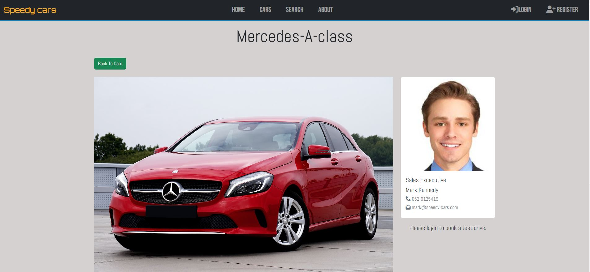
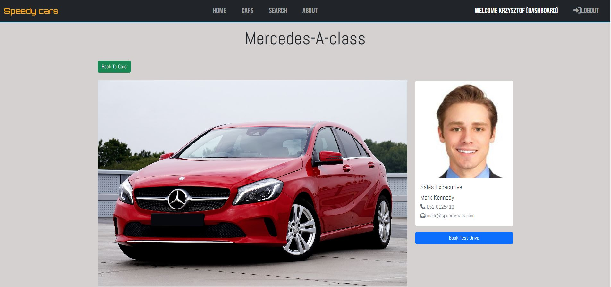
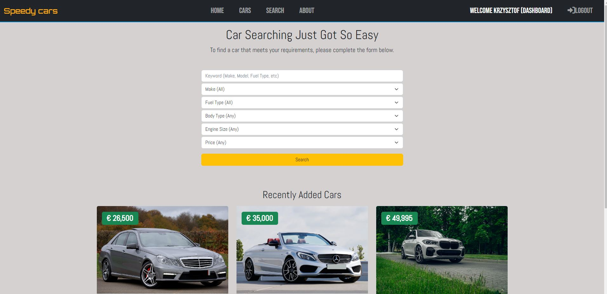
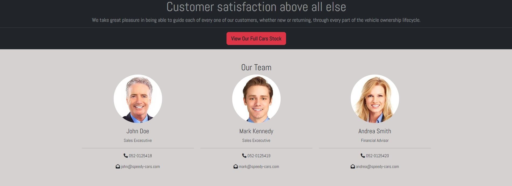
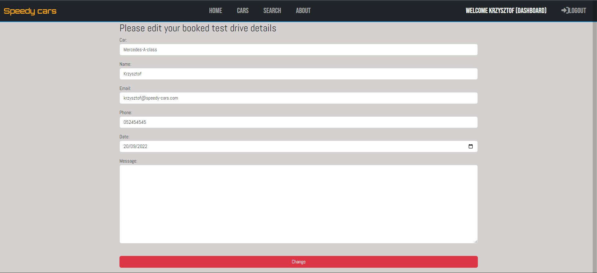
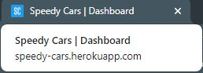

# Speedy Cars

[View the live project here.](https://speedy-cars.herokuapp.com/)

This full-stack framework project was built using Django, PostgreSQL, Python, HTML, CSS, and JavaScript. The Speedy Cars website is designed to display cars for sale to customers and allow them to book, edit or cancel test drives. The website also provides an option to find a car with specific search criteria. The business owner can also easily manage the cars stock from the administration panel.

## Table of contents

- [Speedy Cars](#speedy-cars)
  - [User Experience (UX)](#user-experience-ux)
    - [Primary Goal](#primary-goal)
  - [User Requirements and Expectations](#user-requirements-and-expectations)
  - [User Stories](#user-stories)
    - [Users](#users)
    - [Site owner](#site-owner)
    - [Error Handling](#error-handling)
  - [Agile Methodology](#agile-methodology)
    - [Kanban dashboard](#kanban-dashboard)
  - [Wireframes - Desktop](#wireframes-desktop)
  - [Wireframes - Tablet](#wireframes-tablet)
  - [Wireframes - Mobile](#wireframes-mobile)
  - [Site Map](#site-map)
  - [Structure](#structure)
    - [Code Structure](#code-structure)
    - [Database design](#database-design)
     [Models](#models)
  - [Design Choices](#design-choices)
    - [Home page background](#home-page-background)
    - [Fonts](#fonts)
    - [Colours](#colours)
  - [Features](#features)
    - [Responsive design](#responsive-design)
    - [Homepage](#homepage)
    - [Navigation Menu](#navigation-menu)
    - [Cars page](#cars-page)
    - [Pagination](#pagination)
    - [Car details page](#car-details-page)
    - [Thumbinals](#thumbinals)
    - [Ability to book a test drive with a specific car](#ability-to-book-a-test-drive-with-a-specific-car)
    - [Search page](#search-page)
    - [Preserving search inputs selected by the user](#preserving-search-inputs-selected-by-the-user)
    - [About page](#about-page)
    - [Dashboard](#dashboard)
    - [Messages system to provide feedback to the user](#messages-system-to-provide-feedback-to-the-user)
    - [Footer](#footer)
    - [Dynamic page titles](#dynamic-page-titles)
    - [Authentication](#authentication)
    - [Error handling](#error-handling)
    - [Customized Admin (the business owner) panel](#customized-admin-the-business-owner-panel)
    - [Admin panel - ability to add a new car](#admin-panel---ability-to-add-a-new-car)
    - [Admin panel - ability to add a new employee](#admin-panel---ability-to-add-a-new-employee)
    - [Admin panel - ability to review booked driving tests](#admin-panel---ability-to-review-booked-driving-tests)
    - [Admin panel – ability to select cars that will be displayed on the page](#admin-panel---ability-to-select-cars-that-will-be-displayed-on-the-page)
  - [Features to be implemented](#features-to-be-implemented)
  - [UX testing](#ux-testing)
  - [Manual Testing](#manual-testing)
  - [Automated tests](#automated-tests)
  - [Code Validation](#code-validation)
    - [HTML](#html)
    - [Python](#python)
      - [speedy_cars project](#speedy_cars-project)
      - [booking app](#booking-app)
      - [cars app](#cars-app)
      - [employees app](#employees-app)
      - [home](#home)
    - [CSS](#css)
    - [JS](#js)
    - [Color Contrast Accessibility Validator](#color-contrast-accessibility-validator)
    - [Lighthouse testing](#lighthouse-testing)
    - [Accessibility testing](#accessibility-testing)
  - [Technologies Used](#technologies-used)
    - [Languages](#languages)
      - [Python Libraries](#python-libraries)
    - [Database](#database)
    - [Frameworks](#frameworks)
    - [Programs & Tools](#programs-and-tools)
  - [Bugs](#bugs)
  - [Unfixed bugs](#unfixed-bugs)
  - [Deployment](#deployment)
    - [Using Github & Gitpod](#using-github-and-gitpod)
    - [Deployment to heroku](#deployment-to-heroku)
    - [Final deployment](#final-deployment)
    - [Forking the GitHub Repository](#forking-the-github-repository)
    - [Cloning This Project](#cloning-this-project)
  - [Credits](#credits)
  - [Content](#content)
  - [Acknowledgments](#acknowledgments)

## User Experience (UX)

### Primary Goal

The primary goal of the website, from the site owner’s perspective, is as follows:

- To attract customers to the business by showing a variety of cars for sale
- To allow a user to navigate the website easily
- To allow a user to make an inquiry about a car
- To allow a user to book a test drive
- To allow a user to easily search a car they are looking for
- Ability to add a new car for sale
- To allow a user to read testimonials about the Speedy Cars

The primary goal of the website, from a site user’s perspective, is as follows:

- To view the car’s stock
- To view details about the car along with a description and price
- To be able to easily find a car they are looking for
- To book a test drive
- To make an inquiry about the car
- To view opening hours and address
- To read more about the business
- To view other customer’s testimonials about Speedy Cars

[Back to Top](#table-of-contents)

## User Requirements and Expectations

- Easy to navigate by using a few buttons
- Appealing dashboard with a functional overview
- No broken links
- Appropirate error handling
- Responsive and visually appealing on all devices.
- Ability to make an inquiry about the car
- Ability to book a test drive
- Ability to edit or cancel a test drive

[Back to Top](#table-of-contents)

## User Stories

### Users

- As a user, I want to be able to view all available cars in one of the categories:
  - Petrol
  - Diesel
  - Hybrid
  - Electric
- As a user, I want to see a description of each car available for sale along with relevant pictures.
- As a user, I want to be able to navigate the website quickly and easily.
- As a user, I want to be able to use the search option to find the car I’m looking for.
- As a user, I want to be able to view the price of the car.
- As a user, I want to be able to read other users’ testimonials.
- As a user, I want to be able to inquire about the car.
- As a user, I want to be able to book a test drive.
- As a user, I want to be able to edit or delete a test drive I have made.
- As a user, I want to read more information about the business.
- As a user, I want to be able to see featured(recently added) cars.
- As a user, I want to be able to sign in to or create an account.
- As a user, I want to be able to log out of an account.
- As a user, I want to be able to view the business’s social media channels.
- As a user, I want to log in after I created an account and see my test drive bookings.
- As a user, I want to be informed if a test drive cannot be booked for any reason.
- As a user, I want to be informed if a test drive was booked successfully.

### Site owner

- As a user, I want to attract car buyers.
- As a user, I want an appealing website with a range of cars.
- As a user, I want users to be able to view the full range of cars available for sale.
- As a user, I want users to be able to view the relevant description of each car along with the price.
- As a user, I want users to be able to have an option to search for the car they are looking for.
- As a user, I want users to be able to make an inquiry about the car.
- As a user, I want users to be able to book a test drive with the selected car.
- As a user, I want users to be informed if a test drive cannot be booked.
- As a user, I want users to be able to edit and cancel a test drive.
- As a user, I want users to be able to read about the business.
- As a user, I want users to be able to navigate the site easily and quickly.
- As a user, I want users to be able to sign in to or create an account.
- As a user, I want users to be able to log out of their accounts.
- As a user, I want to be able to add new cars or remove them if they are sold.
- As a user, I want users to be able to view the business's social media.
- As a user, I want to be able to add testimonials.

### Error Handling

- If the page cannot be loaded, the user should be able to return through the website's navigational structure without hitting the back button on their browser.

[Back to Top](#table-of-contents)

## Agile Methodology

### Kanban dashboard

Github issues were used to create the User stories and group them according to MoSCoW prioritization technique. Link to the project with live issues can be found [HERE](https://github.com/users/kwalczak80/projects/7). The issues are currently in two categories - **done** or  **not for this deadline**.

[Back to Top](#table-of-contents)

## Wireframes-Desktop

- [Home page](docs/wireframes/desktop/home_page_desktop.png)
- [Cars page](docs/wireframes//desktop/cars_page_desktop.png)
- [Car page](docs/wireframes/desktop/car_page_desktop.png)
- [About page](docs/wireframes/desktop/about_page_desktop.png)
- [Search page](docs/wireframes/desktop/search_page_desktop.png)
- [Login page](docs/wireframes/desktop/login_page_desktop.png)
- [Logout page](docs/wireframes/desktop/logout_page_desktop.png)
- [Registration page](docs/wireframes/desktop/registration_page_desktop.png)
- [Dashboard page](docs/wireframes/desktop/dash_board_desktop.png)
- [Edit test drive page](docs/wireframes/desktop/edit_test_drive_page_desktop.png)

[Back to Top](#table-of-contents)

## Wireframes-Tablet

- [Home page](docs/wireframes/tablet/home_page_tablet.png)
- [Cars page](docs/wireframes/tablet/cars_page_tablet.png)
- [Car page](docs/wireframes/tablet/car_page_tablet.png)
- [About page](docs/wireframes/tablet/about_page_tablet.png)
- [Search page](docs/wireframes/tablet/search_page_tablet.png)
- [Login page](docs/wireframes/tablet/login_page_tablet.png)
- [Logout page](docs/wireframes/tablet/logout_page_tablet.png)
- [Registration page](docs/wireframes/tablet/registration_page_tablet.png)
- [Dashboard page](docs/wireframes/tablet/dashboard_page_tablet.png)
- [Edit test drive page](docs/wireframes/tablet/edit_test_drive_page_tablet.png)

[Back to Top](#table-of-contents)

## Wireframes-Mobile

- [Home page](docs/wireframes/mobile/home-page-mobile.png)
- [Cars page](docs/wireframes/mobile/cars-page-mobile.png)
- [Car page](docs/wireframes/mobile/car-page-mobile.png)
- [About page](docs/wireframes/mobile/about-page-mobile.png)
- [Search page](docs/wireframes/mobile/search-page-mobile.png)
- [Login page](docs/wireframes/mobile/login-page-mobile.png)
- [Logout page](docs/wireframes/mobile/logout-page-mobile.png)
- [Registration page](docs/wireframes/mobile/registration-page-mobile.png)
- [Dashboard page](docs/wireframes/mobile/dashboard-page-mobile.png)
- [Edit test drive page](docs/wireframes/mobile/edit_test-drive-page-mobile.png)

[Back to Top](#table-of-contents)

## Site Map

The information architecture was organized in such a way as to ensure that users can navigate through the site easily.

[Back to Top](#table-of-contents)

## Structure

### Code Structure

The project is organized into various applications, as constructed using the Django Framework.
App details are as follows:

- Home - this app contains information about the Speedy Cars home page with quick links to the about and search pages via the nav bar.
- Booking - this app contains information related to the test drive booking system (for users to view, edit or cancel booked test drives).
- Cars - this app is for the users to view the cars or to view the car search results.
- Employees - this app is for the business owner to manage Speedy Cars staff via admin panel.

To complement the apps there are

- Speedy Cars: Speedy Cars level files - settings.py for project level settings and urls.py to route the website urls.
- templates: Containing the base.html, allauth(django authentication). The partial folder contains the navbar and footer HTML.
- templates (app level): some of the apps have their own templates directory for HTML to consider portability and reuse.
- urls (app level): each app has its own url.py file to consider portability and reuse.
- static: CSS files for the website and admin panel. Javascript file is also included in this folder.
- manage.py: This file is used to start the site and perform functions during development.
- README.md: Documentation about the project.
- Procfile: To run the application on Heroku.
- Requirements.txt: Containing the project dependencies. Note: Environment variable values are not exposed in the source code as they are stored locally in env.py that is not checked in(listed in .gitignore).

### Database design

The data schema was created using [drawsql](https://drawsql.app/ "drawsql")

### Models

The following models were created to represent the database model structure for the website

Car model

- The car model contains a collection of data for each car displayed on the website. This model is being used by the business owner (via admin panel) each time a new car is added.

| Name | Key | Type | Other Details |
| -- | -- | -- | -- |
| sales_person | Employee | FK from Employee |  |
| title| | CharField | Max length 300 Set default as ''|
| make | | CharField | Max length 50 Set default as 'Audi'|
| model || CharField | Max length 50 |
| price ||IntegerField| Set default as 1 |
| fuel_type ||CharField| Set default as 'Petrol' |
| transmission ||CharField| Set default as 'Manual |
| body_type ||CharField| Set default as 'Coupe' |
| year||IntegerField| Set default - current year |
| engine_size ||CharField| Set default as '1.0 L' |
| milage ||IntegerField| Set default as 1 |
| description ||TextField| Set default as '' |
| previous_owners ||IntegerField| Set default as 1 |
| road_text ||IntegerField| Set default as 1 |
| is_for_sale ||BooleanField| Set default as True |
| photo_main ||CloudinaryField|  |
| photo_1 ||CloudinaryField|  |
| photo_2 ||CloudinaryField|  |
| photo_3 ||CloudinaryField|  |
| photo_4 ||CloudinaryField|  |
| photo_5 ||CloudinaryField|  |
| photo_6 ||CloudinaryField|  |
| date ||DateField| Set default as now(timestamp) |

Booking model

- The Booking model contains a collection of data submitted by the user when booking a test drive.

| Name | Key | Type | Other Details |
| -- | -- | -- | -- |
| car | | CharField | Max length 100 |
| car_id | | IntegerField | Set default date as 0 |
| name | | CharField | Max length 200|
| email || CharField | Max length 100 |
| phone || CharField | Max length 100 |
| date || DateField | Set default date as today's date |
| meassage || TextField | |
| user_id || IntegerField | Set default date as 0 |

Employee model

- The employee model is being used by the business owner(via admin panel) to enter information about the employee. Some fields from this model are dynamically displayed on the website.

| Name | Key | Type | Other Details |
| -- | -- | -- | -- |
| name | | CharField | Max length 100 Set default as '' |
| photo | | CloudinaryField | |
| description | | TextField | Set default as ''|
| email || CharField | Max length 50 |
| hire_date || DateTimeField | Set default date as now |

[Back to Top](#table-of-contents)

## Design Choices

### Home page background

As I wanted a more attractive and dynamic home page, I decided to use a video as a background. After analyzing some interesting video clips, I found one that, in my opinion, was perfect for this project. The video clip used in the project reflects the theme of the site very well and, at the same time, does not distract the user's attention from other parts of the site, therfore I decided to use it as a looped video background for the site.

### Fonts

I visited the Google fonts website to explore the available font options for my project. After consideration, three different font types were chosen to be used in different sections of the website.

- The [Bebas Neue font](https://fonts.google.com/?query=bebas "Bebas Neue font") font is used in navigation bar and to display the slogan on the home page.
- The [Orbitron font](https://fonts.google.com/?query=orbitron "Orbitron font") font is used to display the business name in the navbar.
- The [Abel font](https://fonts.google.com/?query=abel "Abel font") font is used to display all other text information.

### Colours

I used [Coolors](https://coolors.co/) to come up with a color scheme.
The color palette was intended to create a fairly neutral background so that the photos of the cars stand out as much as possible.

- #ffac0c - the business name and the text displayed on the home page
- #d4d1d1 - the background color displayed on all pages except the home page
- #212529 - navbar and footer background color
- #ffffff - cards background color
- #00ffff - hover effect color

[Back to Top](#table-of-contents)

## Features

### Responsive design

The website has been designed using Bootstrap 5 therefore it's fully responsive on all screen sizes.

### Homepage

The home page is a simple set of navigation elements, a background video, and a short slogan displayed on the screen.

The video background fits perfectly into the context of the project and the purpose of the website.

### Navigation Menu

Depending on whether the user is logged in or not, different links are made available in the completely responsive navbar.

- For a user that is not signed in, the following options are available:
  - Speedy Cars(the business name displayed on the navigation bar)
  - Home - *link to the home page*
  - Cars - *link to the page with cars for sale*
  - Search - *link to the search page*
  - About - *link to the about page*
  - Login - *link to the login page*
  - Register - *link to the user registration page*

- For a user that is signed in, the following options are available:
  - Speedy Cars(the business name displayed on the navigation bar)
  - Home *link to the home page*
  - Cars - *link to the page with cars for sale*
  - Search - *link to the search page*
  - About - *link to the about page*
  - Welcome (User Name) (dashboard) - *link to the dashboard page*
  - Logout - *link to the logout page*

- A hover effect is implemented to visually highlight menu links(except the dashboard link) when the user hovers over them. The dashboard link(visible when the user is logged in) is always displayed in white.

### Cars page

When the user clicks on the **Cars** link in the navigation bar, they will be redirected to a page where they can view all the cars that are available for sale.

The form of presentation of each car is the same and consists of displaying a single photo of the car, the price and basic information about the car. The information is presented using Font Awsome icons and text in a minimalist way. The basic information about the car that the user can read is as follows:

- Engine type
- Engine size
- Mileage
- Year of manufacture
- Gearbox type
- Body type
- Information about when the car was posted on the website

The **More info** button allows the user to be redirected to a page where additional information about the specific car will be presented.

### Pagination

Each **Cars** page may contain up to six cars displayed on the page. If the number of cars in the database does not exceed six, then pagination is not visible.

However, if the number of cars exceeds six, then the pagination is active(displayed in the middle of the screen). The user can then change pages by clicking on arrows or directly clicking on the page they want to move to. If the user is on the first page, then the left arrow icon is inactive as page one is the start page. On the other hand, when the user is on the last page, the right arrow is inactive because it is the last page available.

### Car details page

When the user is interested in a specific car and clicks on the **More info** button, they will be redirected to a page where they can find additional photos and information about the car.
This page is divided into sections:

- Photos - additional photos are presented as thumbnails. Clicking on any of the thumbnail images will launch the lightbox gallery, so the user will be able to view all the photos in detail (please read about thumbnails below).
- Additional information is presented using Font Awsome icons and text:
  - Price(no longer presented as a badge on the main picture)
  - Road tax
  - Previous owners
  - NCT(National Car Testing) due date
- Car description section that contains more info about the car
- Information about the sales executive who is responsible for selling the car. The information presented on the sales executive card contains:
  - The picture of the sales executive
  - Sales executive name
  - Phone number
  - Email address
  - If the user is logged in, the button to book a test drive will also be visible. If the user is not logged in, an appropriate message will be displayed below the sales executive card(please read about this feature below).

The user also has an option to return to viewing all cars by clicking on the **Back to cars** button, which is located above the car's main photo.

### Thumbinals

When the user clicks on the **More info** button, they will be redirected to the page to view more details about the car they are interested in.

On this page, additional images of the car will be available to view below the main picture as thumbnails. Once clicked on the thumbnail, it will enlarge and the user will be able to scroll through all available images.
The user can use the keyboard left or right keys or arrow keys presented on the screen to scroll through all available images.
The images presentation can be closed by clicking on the **X** button(upper right-hand corner) or outside the presentation area.

### Ability to book a test drive with a specific car

In order to book a test drive, the user must be logged in. If the user is not logged in, the **Book test drive** button will not be visible.

If the user is logged in, the **Book test drive** button will be visible below the sales executive's name card.

When the user clicks on the **Book test drive** button, a modal window will be opened. The user must provide additional information in order to complete the test drive booking process.
The following fields can be seen in the modal window:

- Car - this field is automatically populated and cannot be modified(read-only)
- Name - this field is automatically populated. The user name is pulled from the database and cannot be modified(read-only)
- Email - this field is automatically populated if the user provided an email address during registration. If not, the user can enter their email address at this stage. This is a required field to complete the test drive booking process.
- Phone - the user must enter their phone number in order to complete the booking process. This is also a required field.
- Date - the user must select the date when they want to book a test drive. By default, this field always shows the current date. Important - if the user selects a date that is in the past, the booking process will be cancelled and an appropriate error message will be displayed on the screen(please read about the message system below).
- Message - the user can provide additional information if they want. This field is optional and does not affect the test drive booking process if left blank.

Once all required fields are populated the user can click on the **Submit** button to book a test drive.
An appropriate message will be displayed on the screen to confirm that the test drive was booked successfully.

Important - the user cannot book a test drive twice in the same car, as the booking process will be canceled and an appropriate message will be displayed on the screen(please read about the message system below).

### Search page

The search page consists of two sections:

- The search form where the user can enter or select their search criteria
- Pictures of cars recently added for sale(only the three recently added cars will be displayed). This section will no longer be visible once the user clicks on the **Search** button.

The search form allows the user to find a car according to the criteria entered or selected by the user.
The user can use the following search options:

- Keyword - enter any keyword that will be searched in the database.
- Make - select a car make from the dropped-down menu
- Fuel type - select fuel type from the dropped-down menu
- Body type - select a body type from the dropped-down menu
- Engine size - select an engine size from the dropped-down menu
- Price - select a car price from the dropped-down menu. This will display all cars up to the value selected by the user.

The search criteria can be combined, i.e. the user can select any value ​​from the drop-down menu for each field. The search results (if any) will be displayed below the search form.

If the search result does not exist an appropriate message will be displayed on the screen.

### Preserving search inputs selected by the user

The search form does not reset the values ​​entered or selected by the user after each search, which can be very helpful i.e., the user can search for a specific car model (which they selected earlier) by changing only the price range — no need to make all selections again.
To reset the form to its default values, the user has to click on the **Search** link located in the navigation bar.

### About page

On the **About** page, the user can:

- read information about Speedy Cars' business.

- check the business's opening hours and its location(a special script is implemented to highlight the current day of the week)

- find contact details for the people who are running the business in case of any queries.

### Dashboard

The dashboard panel is accessible only to logged-in users, and it is accessible from the navigation bar.
The link to the dashboard is always highlighted in white to stand out from other links.

On the dashboard page, the user can check if they have booked any test drives.
If the user has not booked any test drives, the appropriate information will be displayed on the screen.

If the user has booked test drives, all of them will be displayed on the screen.

The information about booked test drives contains:

- Name of the car that was reserved for a test drive
- Date when the test drive will take place

The logged-in user has the following options in the dashboard panel if they have booked at least one test drive:

- by using the **View** button to view the car booked for a test drive
- by using the **Edit** button to edit the information provided when booking a test drive (i.e. phone number, email address, test drive date).
Important - Car and Name fields are not editable as this information is pulled from the database.

Once the user has updated the information they wanted to change, they can click the **Change** button to update the information in the database.
A confirmation message will be displayed on the screen (please read about the message system below).

- by using the **Cancel** button to cancel the test drive. In this case, a separate page will be displayed where the user will have to confirm whether or not they want to cancel the test drive.
If the user clicks on the **Yes** button, the test drive will be canceled (deleted from the database) and will no longer be presented on the dashboard panel.
If the user clicks on the **Cancel** button, they will be redirected to the dashboard panel.

### Messages system to provide feedback to the user

Messages are displayed for continual feedback to the user on their interactions and follow the same layout for both mobile and desktop designs. These interactions include:

- Sign in

- Logout

- Test drive booking confirmation

- Incorrect test drive date selected error message

- Test drive booking cancellation message

- Test drive double booking error message

- Edit test drive confirmation

### Footer

Footer is kept very simple as set of links and the businnes name. Footer layout remians the same on all screen sizes.
The javascript function automatically update the year which is displayed on the footer.
A special javascript function automatically updates the year which is displayed on the footer.

Please also note that the footer is displayed only on selected pages.

A hover effect is implemented if the user hovers over the social media links

### Dynamic page titles

Each page has an individual name located on the tab which can help the user quickly find out on which page they are currently on

- Home page

- Cars page

- Car page

- About page

- Search page

- Dashboard page

- Login page

- Logout page

- Register page

### Authentication

The authentication process for the application is handled by Django allauth and consists of three parts.

- Sign Up

If the user entries are wrong, the relevant error message will be displayed on the screen, informing what needs to be corrected to complete the registration process.

- Sign In

The sign-in form requires only two fields to be entered.

- Username
- Password

If the user name or password is incorrect, an error message will be shown on the screen.

- Log out

If the user decides to log out, they will be redirected to the page to confirm their choice.

### Error handling

404 page

If the page the user is trying to reach is not accessible, the following error message will be displayed on the screen.
The user can return to the home page by pressing the home button. There is no need to hit the back button on the browser.

500 page

A 500 server error page was also created to handle internal server errors.

### Customized Admin (the business owner) panel

The admin panel was adjusted with the following changes:

- the name of the business is now displayed on the top bar
- the color scheme was slightly changed
- the color of some buttons was changed

The changes above were only cosmetic, but thanks to that, the panel looks a little bit different than the standard Django panel.

### Admin panel - ability to add a new car

The business owner can add a new car to the website via the admin panel.
In this panel, there is also an option to delete the car from the database.

### Admin panel - ability to add a new employee

The business owner can add a new employee via the admin panel.
All the information about the staff(photo, name, email, etc.) that is displayed on the website(About page) comes from the database, and it's not hard coded in HTML.
Therefore, in the event of any changes(i.e. new employee), the updated information will be automatically displayed on the website.

### Admin panel - ability to review booked driving tests

The business owner can review booked test drives via the booking panel.
The panel contains the following information regarding booked test drives:

- Booking ID
- User ID (the user who booked a test drive)
- Name (the user name)
- Car (the car that is booked for a test drive)
- Car ID
- Email (the email address that the user provided during the test drive booking process)
- Phone (phone number that the user provided during the test drive booking process)

### Admin panel - ability to select cars that will be displayed on the page

This feature allows the business owner to enable or disable the car to be visible on the website. There is no need to delete the car from the database if, for some reason, the business owner does not want it to be displayed on the website(i.e., the car is reserved or not ready for sale).

If the **Is for sale** check box is selected, the car will be shown on the website.

If all **Is for sale** check boxes are deselected, an appropriate message will be displayed on the screen.

[Back to Top](#table-of-contents)

## Features to be implemented

- Ability to book a test drive by the user at a specific time(not only a date)
- Email notification to the staff that the car was booked for a test drive.
- Email notification to the user with the booked test drive date.
- Ability to make an inquiry about the car.
- Ability to add(by the user) a testimonial about Speedy Cars
- Ability to view testimonials about Speedy Cars
- Ability to approve testimonials by the business owner(after approval, testimonials can be displayed on the page).
- Add more car searching options(i.e. model, mileage, min year, max year, etc.).
- Add the business location on Google Maps.

All the features mentioned above would be a great improvement for this website. However, due to the upcoming deadline to submit this project, it is not possible to implement them all at this stage.

[Back to Top](#table-of-contents)

## UX testing

| User requirements | Implemented | Tested | Comments
| ------------ | ----------- | ------ | --------
|I want to be able to view all available cars in one of the categories:Petrol, Diesel, Hybrid, Electric|Yes|Yes|On the search page, the user can select the cars in each of the four available categories.
|I want to see descriptions of each car available for sale along with relevant pictures|Yes|Yes|When the user clicks on the 'More info' button on the car card, additional photos of the car and a description will be shown.
|I want to be able to navigate the website quickly and easily|Yes|Yes| The website is uncomplicated in layout and has clear and intuitive navigation.
|I want to be able to use the search option to find the car I’m looking for|Yes|Yes| On the search page, the user has the option to search for a car according to specific user requirements.
|I want to be able to view the price of the cars|Yes|Yes| Each car presented on the website has a label with the price.
|I want to be able to read other user’s testimonials|No|No| Future feature - see the section above
|I want to be able to make an inquiry about the car|No|No| Future feature - see the section above
|I want to be able to book a test drive|Yes|Yes| When the user is logged in, they have the option to book a test drive by clicking on the **Book test drive** button located beneath the sales executive card.
|I want to be able to edit or delete a test drive I have made|Yes|Yes| The logged-in user has an option to edit or cancel their booked test drive(CRUD functionality).
|I want to read more information about the business|Yes|Yes| On the **About** page, the user can find all relevant information about Speedy Cars.
|I want to be able to see featured cars|Yes|Yes| On the search page, the user can find three recent cars added for sale.
|I want to be able to sign in to or create an account|Yes|Yes| The user has an option to create a new account or to log in to the one they created.
|I want to be able to log out of an account|Yes|Yes|The user has the option to log out of their account.
|I want to be able to view the business’s social media channels|Yes|Yes| All links to the social media channels are available in the footer.
|I want to log in after I created an account and see my test drive bookings|Yes|Yes| Once the user is logged in, the dashboard panel will be available in the navigation bar. By clicking on the **dashboard** link, the user will be redirected to the page with their test drive booking details.
|I want to be informed if a test drive cannot be booked for any reason|Yes|Yes| The message system provides feedback to the user about their interactions. If a test drive cannot be booked relevant information will be displayed on the screen.
|I want to be informed if a test drive was booked successfully|Yes|Yes| The message system provides feedback to the user about their interactions. If a test drive is booked successfully, relevant information will be displayed on the screen.

|Business owner requirements | Implemented | Tested | Comments
| ------------ | ----------- | ------ | --------
|I want to attract car buyers|Yes|Yes|Complete
|I want an appealing website with a range of cars|Yes|Yes| Complete
|I want users to be to view the full range of cars available for sale|Yes|Yes| Complete
|I want users to be able to view the relevant description of each car along with the price|Yes|Yes| Complete
|I want users to able to have an option to search for the car they are looking for|Yes|Yes| Complete
|I want users to be able to make an inquiry about the car|No|No| Future feature - see the section above
|I want users to be able to book the test drive with the selected car|Yes|Yes| Complete
|I want users to be informed if a test drive cannot be booked|Yes|Yes| Complete
|I want users to be able to edit and cancel a test drive|Yes|Yes| Complete
|I want users to be able to read about the business|Yes|Yes| Complete
|I want users to be able to navigate the site easily and quickly|Yes|Yes| Complete
|I want users to be able to sign in to or create an account|Yes|Yes| Complete
|I want users to be able to log out of their account|Yes|Yes| Complete
|I want to be able to add new cars or remove if sold|Yes|Yes| Complete
|I want users to be able to view the business’ social media|Yes|Yes| Complete
|I want to be able to add testimonials|No|No| Future feature - see the section above

| Error handling| Implemented | Tested | Comments
| ------------ | ----------- | ------ | --------
|If the page cannot be loaded, the user should be able to return through the website's navigational structure without hitting the back button on their browser|Yes|Yes|The customized 404 page will be displayed if the page that the user requested is not available. The customized 500 page will be displayed to flag the issue with the server.

[Back to Top](#table-of-contents)

## Manual Testing

Manually testing the design was an ongoing process to make sure everything was working as expected. All bugs and fixes were fixed on an ongoing basis during the project creation. After each fix, manual tests were performed to make sure that everything is working as intended and that the fixes did not cause other errors. Manual tests and checks include:

- Navbar
  - All links navigate to the correct endpoint.
  - The hover effect is working correctly.
  - The dashboard link displays the username, and it is highlighted in white
color (if the user is logged in).
  - Different navigation links are presented on the navigation bar depending on the user authentication.
  - Responsiveness
  - Accessibility is correct.
- Footer
  - All links navigate to the correct endpoint.
  - The hover effect is working correctly.
  - External links open in a new tab.
  - Accessibility is correct.
  - Responsiveness.
- Login and Signup
  - The form is clear and intuitive.
  - Form completes its task correctly
  - Message is displayed to the user on the homepage when signed in
- Logout
  - Options are clear
  - Message is displayed to the user on the homepage when signed out
- Home Page
  - Text is clear and easily read.
  - The video background is correctly displayed.
  - Responsiveness.
- Cars page
  - Responsiveness
  - Pagination occurs when there are more than 6 cars.
  - The user can navigate to the selected page when using the pagination buttons.
  - The **More Info** button navigates to the correct page where the user can
find more details about the car.
  - Images of the cars are displayed correctly.
  - All the font awesome icons and the car details are correctly displayed
on the cards
- Car Page
  - Responsiveness
-The main picture of the car is displayed correctly.
  - All thumbnails are displayed correctly underneath the car's main picture.
  - Thumbnails enlarge once clicked. The lightbox is launched to
start the car's image gallery presentation.
  - All the font awesome icons and car details are correctly displayed on
the card(s)
  - The car description is presented and readable.
  - The **Back To Cars** button navigates back to the Cars page.
  - The sales executive's card is displayed with the image and contact
details
  - The **Book test drive** button is presented underneath the sales
executive card (only if the user is logged in)
  - The **Book test drive** button is not presented for non-logged-in users
(relevant message is displayed instead).
  - The **Book test drive** button opens a modal to book a test drive
- Book test drive modal
  - Responsiveness
  - The form is clear and intuitive.
  - Relevant fields are prepopulated and not editable by the user.
  - The date picker works correctly.
  - Required fields must be entered before the form submission.
  - Error message is displayed on the screen if the date selected by the
user is incorrect (booked in the past)
  - Confirmation message is displayed on the screen if the test drive
booking was successful.
  - The modal is closed if the user clicks in the upper right corner(X button) or
outside of the modal form.
  - The **Submit** button works correctly.
- Search Page
  - Responsiveness
  - The form is clear and intuitive.
  - The drop-down menus are working correctly.
  - The form preserves the user's selections.
  - The form returns correct search results.
  - The search results are displayed correctly on the screen.
  - Recently added cars are displayed correctly.
- About Page
  - Responsiveness
  - Text is clear and easily read
  - All the images are displayed correctly
  - The current day of the week is correctly highlighted in the business opening hours section
  - The footer links are working correctly
  - The **View Our Full Car Stock** navigates to the correct page
- Dashboard Page
  - Responsiveness
  - The Dashboard link is only visible for logged-in users.
  - All booked test drives are displayed on the dashboard page
  - Each test drive contains three buttons:
    - **View** – the button opens the page with the car booked for a test drive
    - **Edit** – the button opens the page to edit the test drive
    - **Cancel** – the button opens the page to confirm if the user wants to cancel a particular test drive
  - A relevant message is displayed on the screen if the user has no test drives booked yet
- Edit test drive
  - Responsiveness
  - Relevant fields are prepopulated and not editable by the user.
  - Required fields must be entered before the form submission.
  - An error message is displayed on the screen if the date selected by the user is incorrect (booked in the past)
  - A confirmation message is displayed on the screen if the test drive booking was successful.
  - The **Change** button works correctly and the correct page is loaded after the form submission
- Delete test drive
  - A proper message is displayed each time the user wants to cancel the test drive
  - **Cancel** button returns to the dashboard
  - The **Yes** button deletes the booked test drive from the database and redirects the user to the dashboard page.

[Back to Top](#table-of-contents)

## Automated tests

Automated tests have not been created due to time constrains of the project.

[Back to Top](#table-of-contents)

## Code Validation

### HTML

The HTML code within the application was validated by [W3C Markup Validation Service](https://validator.w3.org/). Pages were put through the validator seperatly, and the results can be seen below.

- [Home page](docs/validation/html/home-page.JPG)
- [Cars page](docs/validation/html/cars-page.JPG)
- [Car page](docs/validation/html/car-page.JPG)
- [Search page](docs/validation/html/search-page.JPG)
- [About page](docs/validation/html/about-page.JPG)
- [Dashboard page](docs/validation/html/dash-board-page.JPG)
- [Login page](docs/validation/html/login-page.JPG)
- [Logout page](docs/validation/html/logout-page.JPG)
- [Register page](docs/validation/html/signup-page.JPG)

### Python

The Python code within the application was validated by [PEP8 online validation service](http://pep8online.com/). Files were put through the validator separately, and the results can be seen below.

#### speedy_cars project

- [settings.py validation results](docs/validation/python/speedy_cars/speedy_cars-settings-python-validation.JPG)
- [urls.py validation results](docs/validation/python/speedy_cars/speedy_cars-urls-python-validation.JPG)

#### booking app

- [admin.py validation results](docs/validation/python/booking/booking-admin-python-validation.JPG)
- [apps.py validation results](docs/validation/python/booking/booking-apps-python-validation.JPG)
- [forms.py validation results](docs/validation/python/booking/booking-forms-python-validation.JPG)
- [models.py validation results](docs/validation/python/booking/booking-models-python-validation.JPG)
- [urls.py validation results](docs/validation/python/booking/booking-urls-python-validation.JPG)
- [views.py validation results](docs/validation/python/booking/booking-views-python-validation.JPG)

#### cars app

- [admin.py validation results](docs/validation/python/cars/cars-admin-python-validation.JPG)
- [apps.py validation results](docs/validation/python/cars/cars-apps-python-validation.JPG)
- [choices.py validation results](docs/validation/python/cars/cars-choices-python-validation.JPG)
- [models.py validation results](docs/validation/python/cars/cars-models-python-validation.JPG)
- [urls.py validation results](docs/validation/python/cars/cars-urls-python-validation.JPG)
- [views.py validation results](docs/validation/python/cars/cars-views-python-validation.JPG)

#### employees app

- [admin.py validation results](docs/validation/python/employees/employees-admin-python-validation.JPG)
- [apps.pyvalidation results](docs/validation/python/employees/employees-apps-python-validation.JPG)
- [models.py validation results](docs/validation/python/employees/employees-models-python-validation.JPG)

#### home

- [apps.py validation results](docs/validation/python/home/home-apps-python-validation.JPG)
- [urls.py validation results](docs/validation/python/home/home-urls-python-validation.JPG)
- [views.py validation results](docs/validation/python/home/home-views-python-validation.JPG)

### CSS

The CSS code within the application was validated by [W3C CSS Validation Service](https://jigsaw.w3.org/css-validator/), and the results can be seen below.

[CSS Admin validation results](docs/validation/css/css-validation-admin-area.JPG)
[CSS validation results](docs/validation/css/css-validation.jpg)

### JS

The JavaScript and JQuery code within the application was validated by [JSHint](https://jshint.com/), and the results can be seen below.

[JS validation results](docs/validation/js/js-validation-results.JPG)

### Color Contrast Accessibility Validator

The [Color Contrast Accessibility Validator](https://color.a11y.com/) was used to check if there is no contrast issue on the web page.

[Contrast validation results](docs/validation/contrast-validation/color-contrast-accessibility-validator-results.JPG)

### Lighthouse testing

The Lighthouse tool was used to assess the website's performance, accessibility, and SEO. The results are shown below.

- [Home page](docs/validation/lighthouse-testing/lighthouse-testing-home-page.JPG)
- [Cars page](docs/validation/lighthouse-testing/lighthouse-testing-cars-page.JPG)
- [Car page](docs/validation/lighthouse-testing/lighthouse-testing-car-page.JPG)
- [Search page](docs/validation/lighthouse-testing/lighthouse-testing-search-page.JPG)
- [About page](docs/validation/lighthouse-testing/lighthouse-testing-about-page.JPG)

### Accessibility testing

I have tested the pages of the application using [WAVE](https://wave.webaim.org/)to ensure there are no errors. The results can be seen by following the links below.

- [Home page](docs/validation/accessibility/accessibility-home-page.JPG)
- [Cars page](docs/validation/accessibility/accessibility-cars-page.JPG)
- [Car page](docs/validation/accessibility/accessibility-car-page.JPG)
- [Search page](docs/validation/accessibility/accessibility-search-page.JPG)
- [About page](docs/validation/accessibility/accessibility-about-page.JPG)

[Back to Top](#table-of-contents)

## Technologies Used

### Languages

- [HTML](https://en.wikipedia.org/wiki/HTML)
- [CSS](https://en.wikipedia.org/wiki/CSS)
- [JavaScript](https://en.wikipedia.org/wiki/JavaScript)
- [Python](https://en.wikipedia.org/wiki/Python_(programming_language))
- [Jinja](https://jinja.palletsprojects.com/en/3.0.x/templates/)
- [Markdown](https://en.wikipedia.org/wiki/Markdown)

#### Python Libraries

- asgiref==3.5.2
- cloudinary==1.29.0
- dj-database-url==1.0.0
- dj3-cloudinary-storage==0.0.6
- Django==3.2.15
- django-allauth==0.51.0
- gunicorn==20.1.0
- oauthlib==3.2.0
- psycopg2==2.9.3
- PyJWT==2.4.0
- pylint-django==2.5.3
- pylint-plugin-utils==0.7
- python3-openid==3.2.0
- pytz==2022.1
- requests-oauthlib==1.3.1
- sqlparse==0.4.2
- whitenoise==6.2.0

### Database

- [Sqlite](https://www.sqlite.org/index.html)
  - This database was used in local development.
- [PostgreSQL](https://www.postgresql.org/)
  - The site is deployed on Heroku using a Postgress database.

### Frameworks

- [Django](https://www.djangoproject.com/)
  - The project uses Django as the main framework.
- [Boostrap 5](https://getbootstrap.com/)
  - Used for general site layout.
- [Lightbox](https://trvswgnr.github.io/bs5-lightbox/)
  - Used to implement a lightbox gallery.

### Programs and Tools

- [Heroku](https://www.heroku.com/)
  - The project is deployed and hosted by Heroku.
- [Balsamiq](https://balsamiq.com/)
  - Used to create the website wireframes.
- [GitHub](https://github.com/)
  - GitHub was used to store all the project files written in Gitpod.
- [Gitpod](https://www.gitpod.io/)
  - Gitpod was used as a development environment.
- [Cloudinary](https://cloudinary.com/)
  - To store static files for the project
- [Drawsql](https://drawsql.app/)
  - Drawsql was used to design database model for the project.
- [W3School](https://www.w3schools.com/)
  - For problem solving and code searching.
- [Stack Overflow](https://stackoverflow.com/)
  - For problem solving and code searching.
- [Font Awesome](https://fontawesome.com/)
  - Font Awesome was used to add icons that represent links to social media.
- [PEP8 validator](http://pep8online.com/)
  - For checking python convention.

[Back to Top](#table-of-contents)

## Bugs

Unable to migrate models to the database

Fix

The problem was in one of the 000X_xxxxxxxxxx.py files in the migrations folder.
When I created my model, I was forced to add a default value to each table, i.e., float field.
By mistake, I added a string value instead of a number value, and that caused all the issues.
To fix this, I had to manually edit some parts of the migration files (change from str to a number) and then I was able to migrate models to the database.

Unable to access the database after adding db.sqlite3 to .gitignore and running git rm -r --cached.

The folowing error was presented on the screen:
FATAL:  password authentication failed for user "popyrrkqilvwjx"
FATAL:  no pg_hba.conf entry for host "35.195.38.40", user "popyrrkqilvwjx", database "d6tpv8s8mh12kk", no encryption

Fix

The issue was fixed by adding a new security key in env.py from Heroku

Unable to loop through choices

Fix

I omitted in error to add the ‘items’ command - for key, value in make_choices.items

More Info link did not work on the card(unable to click)

Fix

To fix the issue I added the following class to style.css file - **div.card-img-overlay {pointer-events: none;}**

Unable to deploy to Heroku as the following error message was displayed on the Heroku panel:
Error while running '$ python manage.py collectstatic --noinput'.

Fix

This issue was resolved by executing the following command **python3 manage.py collectstatic** in gitpod terminal.
The solution was found on [Stack Overflow](https://stackoverflow.com/questions/36665889/collectstatic-error-while-deploying-django-app-to-heroku)

The error related to the local variable referenced before the assignment was showing on the screen.

I checked the model and I discovered that **date** was missing apostrophes - ''

Fix

Images displayed on cards had no equal height.

Fix

The fix was implmented by adding the following car-img-top class in style.css file

.card-img-top {
width: 100%;
height: 30vh;
object-fit: cover;
}

The solution was found on [Stack Overflow](https://stackoverflow.com/questions/37287153/how-to-get-images-in-bootstraps-card-to-be-the-same-height-width)

issue with responsiveness when displaying the dashboard panel on small screens

Fix

To fix it I implemented the grid system instead of tables.

Cannot read properties of null (reading 'defaultPrevented') showing in the console

Fix

Rewrite the java script function showing alerts

[Back to Top](#table-of-contents)

## Unfixed bugs

No known unfixed bugs present at the time of submission

[Back to Top](#table-of-contents)

## Deployment

The master branch of this repository has been used for the deployed version of this application.

### Using Github and Gitpod

To deploy this Django application, [The Code Institute Full Template](https://github.com/Code-Institute-Org/gitpod-full-template) was used to deploy this Django application.
To create a repository from the template above the following steps were taken:

- Click the **Use This** Template button.
- Add a repository name and brief description.
- Click the **Create Repository** from Template to create a repository.
- To create a Gitpod workspace click **Gitpod**, this can take a
few minutes.
- When on the project it is best to open the workspace from
Gitpod (rather than Github) as this will open the previous workspace rather
than creating a new one.
- Committing work should be done often and should have
clear/explanatory messages, use the following commands to make
commits:
  - git add .: adds all modified files to a staging area
  - git commit -m "A message explaining commit" :commits all changes
to a local repository.
  - git push: pushes all your committed changes to the Github repository.

### Deployment to heroku

In the app

- Add the list of requirements by writing in the terminal "pip3 freeze --local > requirements.txt"
- Git add and git commit the changes made

Log into heroku

- Log into [Heroku](https://www.heroku.com/) or create a new account and log in
- In the top right-hand corner, click “New”; and choose the option to Create a new app.
- Write the app name(it must be unique).
- Choose Region
- Click “Create App”
- Click in resources and select Heroku Postgres database
- Click Reveal Config Vars and add new config "SECRET_KEY"
- Click Reveal Config Vars and add new config "CLOUDINARY_URL"
- Click Reveal Config Vars and add new config "DISABLE_COLLECTSTATIC = 1"
- The next page is the project’s Deploy Tab. Click on the Settings Tab and scroll down to Config Vars
- Next, go to Buildpack section click Add Buildpack select python and Save Changes
- Scroll to the top of the page and choose the Deploy tab
- Select Github as the deployment method
- Confirm you want to connect to GitHub
- Search for the repository name and click the connect button
- Scroll to the bottom of the deploy page and select the preferred deployment type
- Click either Enable Automatic Deploys for automatic deployment when you push updates to Github

### Final deployment

- Create a Procfile web: gunicorn speedy_cars.wsgi
- When development is complete change the debug setting to: DEBUG = False in settings.py
- In Heroku settings, delete the config vars for DISABLE_COLLECTSTATIC = 1

### Forking the GitHub Repository

By forking the GitHub Repository you will be able to make a copy of the original repository on your own GitHub account allowing you to view and/or make changes without affecting the original repository by using the following steps:

- Log in to GitHub and locate the GitHub Repository
- At the top of the Repository (not top of page) just above the "Settings" button on the menu, locate the "Fork" button.
- You should now have a copy of the original repository in your GitHub account.

### Cloning This Project

Clone this project by following the steps:

- Open [GitHub](https://github.com/kwalczak80/Speedy-cars)
- You will be provided with three options to choose from, HTTPS, SSH or GitHub CLI, click the clipboard icon in order to copy the URL
- Once you click the button the fork will be in your repository
- Open a new terminal
- Change the current working directory to the location that you want the cloned directory
- Type 'git clone' and paste the URL copied in step 3
- Press 'Enter' and the project is cloned

[Back to Top](#table-of-contents)

## Credits

Throughout the process of building this website, various online sources have been used to help fix bugs & tackle problems, in addition to multiple modules to create the functionality of this website:

- [Stack Overflow](https://stackoverflow.com/) - To find solutions to the issues I encountered while creating this project.
- [Django CRUD tutorial](https://www.youtube.com/watch?v=vNegKfkopoQ) - Django CRUD tutorial
- [W3Schools](https://www.w3schools.com/django/) - additional source of knowledge
- [Udemy](https://www.udemy.com/) - Brad Traversy Django tutorials
- [Donedeal](https://www.donedeal.ie/) - to find some descriptions of the cars
- [CSS Text Stroke](https://www.html-code-generator.com/css/text-stroke-generator) - to help generate text with relevant CSS style
- [Business Opening hours card](https://bootsnipp.com/snippets/5K3o7) - to create the business opening hours card with current day highlight
- [Lightbox for Bootstrap 5](https://trvswgnr.github.io/bs5-lightbox/) - to create lighbox gallery

[Back to Top](#table-of-contents)

## Content

The artwork used in this project was copied from the following websites:

- [Pexels](https://www.pexels.com/)(images)
- [Defcon27](https://github.com/Defcon27)(home page video background)

[Back to Top](#table-of-contents)

## Acknowledgments

- My Mentor Simen [Eventyret_mentor](https://github.com/Eventyret) for continuous helpful feedback.
- [Code Institute's](https://codeinstitute.net/ie/) Slack community for their support. Special thanks to Kasia Bogucka from Code Institute.
- All family members and friends who helped test this application.

[Back to Top](#table-of-contents)