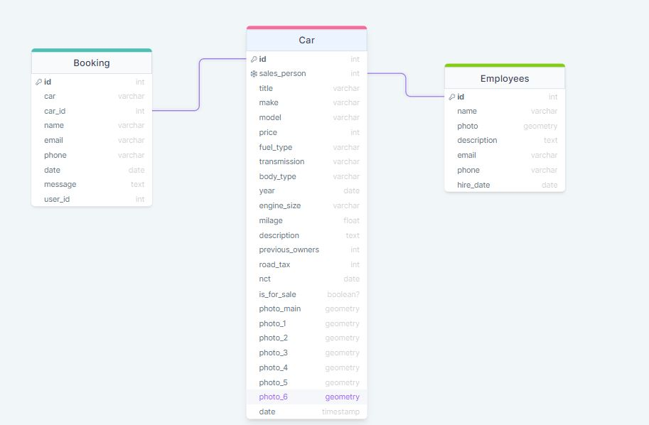

# Speedy Cars

## User Experience (UX)

### Primary Goal

The primary goal of the website from the site owner’s perspective is as follows:

- To attract customers to the business by showing a variety of cars for sale
- To allow a user to navigate the website easily
- To allow a user to make an inquiry about a car
- To allow a user to book a test drive
- To allow a user to easily search a car they are looking for
- Ability to add a new car for sale
- ** To allow a user to read testimonials about the Speedy Cars

The primary goal of the website from a site user’s perspective is as follows:

- To view the car’s stock
- To view details about car along with description and price
- To be able to easily find a car they are looking for
- To book a test drive
- To make an inquiry about the car
- To view opening hours and address
- To read more about the business
- ** To view other customer’s testimonials about Speedy Cars

## User Requirements and Expectations

- Easy to navigate by using the few buttons
- Appealing dashboard with a functional overview
- No broken links
- Appropirate error handling
- Responsive and visually appealing on all devices.
- Ability to make an inquiry about the car
- Ability to book a test drive
- Ability to edit or cancel a test drive

## User Stories

### Users

- As a user, I want to be able to view all available cars in one of the categories:
  - Petrol
  - Diesel
  - Hybrid
  - Electric
- As a user, I want to see professional descriptions of each car available for sale along with relevant pictures
- As a user, I want to be able to navigate the website quickly and easily
- As a user, I want to be able to use the search option to find the car I’m looking for
- As a user, I want to be able to view the price of the cars
- **As a user, I want to be able to read other user’s testimonials
- As a user, I want to be able to make an inquiry about the car
- As a user, I want to be able to book a test drive
- As a user, I want to be able to edit or delete a test drive I have made
- As a user, I want to read more information about the business
- As a user, I want to be able to see featured cars
- As a user, I want to be able to sign in to or create an account
- As a user, I want to be able to log out of an account
- As a user, I want to be able to view the business’s social media channels
- As a user, I want to log in after I created an account and see my test drive bookings
- As a user, I want to be informed if a test drive cannot be completed for any reason
- As a user, I want to be informed if a test drive was booked successfully

### Site owners Goals

- As a site owner, I want to attract car buyers
- As a site owner, I want an appealing website with a range of cars
- As a site owner, I want users to be to view the full range of cars available for sale
- As a site owner, I want users to be able to view the relevant description of each car along with the price
- As a site owner, I want users to able to have an option to search for the car they are looking for
- As a site owner, I want users to be able to make an inquiry about the car
- As a site owner, I want users to be able to book the test drive with the selected car. These need to include data validation so the user can only book future dates and within valid opening times
- As a site owner, I want users to be informed if a test drive cannot be booked
- As a site owner, I want users to be able to edit and cancel a test drive
- As a site owner, I want users to be able to read about the business
- As a site owner, I want users to be able to navigate the site easily and quickly
- As a site owner, I want users to be able to sign in to or create an account
- As a site owner, I want users to be able to log out of their account
- As a site owner, I want to be able to add new cars or remove if sold
- As a site owner, I want users to be able to view the business’ social media
- ** As a logged-in administrator, I want to be able to add testimonials

### Error Flow

- In the event that the desired page cannot be located, the user should be able to return through the website's navigational structure without hitting the back button on their browser

## Wireframes - Desktop

- [Home page](docs/wireframes/desktop/home_page_desktop.png)
- [Cars page](docs/wireframes//desktop/cars_page_desktop.png)
- [Car page](docs/wireframes/desktop/car_page_desktop.png)
- [About page](docs/wireframes/desktop/about_page_desktop.png)
- [Search page](docs/wireframes/desktop/search_page_desktop.png)
- [Login page](docs/wireframes/desktop/login_page_desktop.png)
- [Logout page](docs/wireframes/desktop/logout_page_desktop.png)
- [Registration page](docs/wireframes/desktop/registration_page_desktop.png)
- [Dashboard page](docs/wireframes/desktop/dash_board_desktop.png)
- [Edit test drive page](docs/wireframes/desktop/edit_test_drive_page_desktop.png)

## Wireframes - Tablet

- [Home page](docs/wireframes/tablet/home_page_tablet.png)
- [Cars page](docs/wireframes/tablet/cars_page_tablet.png)
- [Car page](docs/wireframes/tablet/car_page_tablet.png)
- [About page](docs/wireframes/tablet/about_page_tablet.png)
- [Search page](docs/wireframes/tablet/search_page_tablet.png)
- [Login page](docs/wireframes/tablet/login_page_tablet.png)
- [Logout page](docs/wireframes/tablet/logout_page_tablet.png)
- [Registration page](docs/wireframes/tablet/registration_page_tablet.png)
- [Dashboard page](docs/wireframes/tablet/dashboard_page_tablet.png)
- [Edit test drive page](docs/wireframes/tablet/edit_test_drive_page_tablet.png)

## Wireframes - Mobile

- [Home page](docs/wireframes/mobile/home_page_mobile.png)
- [Cars page](docs/wireframes/mobile/cars_page_mobile.png)
- [Car page](docs/wireframes/mobile/car_page_mobile.png)
- [About page](docs/wireframes/mobile/about_page_mobile.png)
- [Search page](docs/wireframes/mobile/search_page_mobile.png)
- [Login page](docs/wireframes/mobile/login_page_mobile.png)
- [Logout page](docs/wireframes/mobile/logout_page_mobile.png)
- [Registration page](docs/wireframes/mobile/registration_page_mobile.png)
- [Dashboard page](docs/wireframes/mobile/dashboard_page_mobile.png)
- [Edit test drive page](docs/wireframes/mobile/edit_test_drive_page_mobile.png)

## Site Map

The information architecture was organized in such a way as to ensure that users can navigate through the site easily.

## Features

- Responsive design,
- Navigation Menu,
- Postgress databases to store information and user login/profile information,
- Ability to book a test drive with a specific car (only for logged-in users - CRUD Functionality),
- Dashboard page where logged-in users can view/edit/cancel existing test drives (CRUD Functionality),
- Customized Admin (the business owner) panel,
- Admin panel - ability to add a new car
- Admin panel - ability to add a new employee
- Admin panel - ability to review booked driving tests
- Admin panel – ability to select cars that will be displayed on the page. No need to delete the car from the database if for some reason the business owner does not want it to be displayed on the website,
- The search page where user can find a car with specific searching criteria,
- Search form "remembers" options selected by the user,
- Dynamic page titles,
- Thumbinals are presented on the screen using Lightbox to allow user to view a car in details,
- Messages system to provide feedback to the user

## Structure

### Code Structure

The project is organized into various applications, as constructed using the Django Framework.
App details are as follows:

- Home - this app contains information about the Speedy Cars home page with quick links to the about and search pages via the nav bar.
- Booking - this app contains information related to the test drive booking system (for users to view, edit or cancel booked test drives).
- Cars - this app is for the users to view the cars or to view the search results.
- Employees - this app is for the business owner to manage Speedy Cars staff via admin panel.

To complement the apps there are

- Speedy Cars: Speedy Cars level files - settings.py for project level settings and urls.py to route the website urls.
- templates: Containing the base.html, allauth(django authentication). The partial folder contains the navbar and footer HTML.
- templates (app level): some of the apps have their own templates directory for HTML to consider portability and reuse.
- urls (app level): each app has its own url.py file to consider portability and reuse.
- static: Base css and Javascript files.
- manage.py: This file is used to start the site and perform functions during development.
- README.md: Readme documentation.
- Procfile: To run the application on Heroku.
- Requirements.txt: Containing the project dependencies Note: Environment variable values are not exposed in the source code as they are stored locally in env.py that is not checked in( listed in .gitignore).

### Database design

The data schema was created using [drawsql](https://drawsql.app/ "drawsql").

#### Models

The following models were created to represent the database model structure for the website

Car model

- The car model contains a collection of data for each car dislpayed on the website. This model is being used by the business owner (via admin panel) each time when a new car is added.
- The model contains the following fields: sales_person(each car has assigned sales advisor - foreign key from employee model),title, make, model, price, fuel type, transmission, body type, year, engine size, milage, description, previous owners, road tax, nct, is for sale(this determines if the car displayed on the website or not), photo main, photo 1, photo 2, photo 3, photo 4, photo 5, photo 6, date.

Booking model

- The Booking model contains a collection of data submitted by the user when booking a test drive.
- The model contains the following fields: car, car_id, name, email, phone, date, message, user_id (this is displayed in admin).

Employee model

- The Employee model is being used by the business owner(via admin panel) to enter information about the employee. Some fields from this model are dynamically displayed on the website.
- The model contains the folowing fields: name, photo, description, email, phone, hire date. .  

